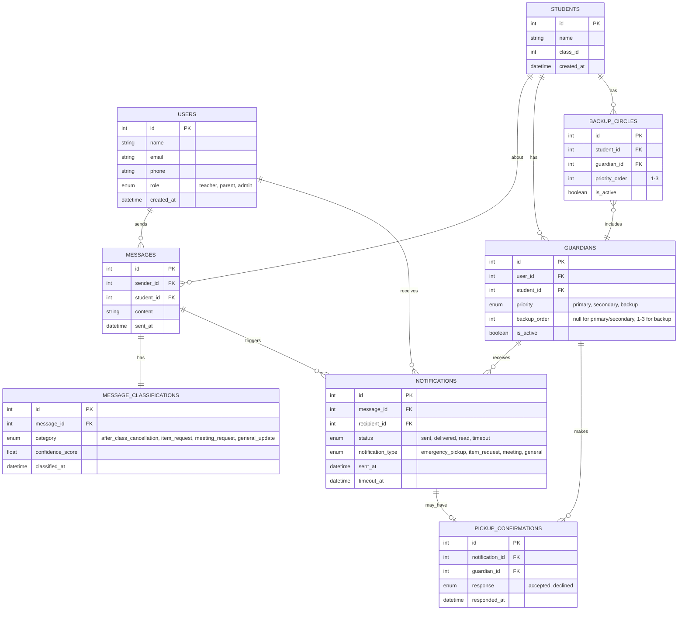

# Database Schema - AI Message Classification System

## Entity Relationship Diagram

## Entity Descriptions

### USERS
Core user table for all system users (teachers, parents, admins).

### STUDENTS
Student records linked to guardians and messages.

### MESSAGES
Teacher messages sent through the chat interface.

### MESSAGE_CLASSIFICATIONS
AI classification results for each message with category and confidence.

### GUARDIANS
Links users (parents) to students with priority hierarchy.
- **primary**: First contact
- **secondary**: Second contact if primary unavailable
- **backup**: Backup circle members (3 max)

### NOTIFICATIONS
All notifications sent to parents with status tracking.

### PICKUP_CONFIRMATIONS
Records parent responses to emergency pickup requests.

### BACKUP_CIRCLES
Pre-configured trusted parents for emergency escalation.

## Key Relationships

1. **Message Flow**: USERS → MESSAGES → MESSAGE_CLASSIFICATIONS → NOTIFICATIONS
2. **Escalation Hierarchy**: Primary Guardian → Secondary Guardian → Backup Circle
3. **Student-Guardian**: Many-to-many through GUARDIANS table with priority levels
4. **Emergency Response**: NOTIFICATIONS → PICKUP_CONFIRMATIONS

## Status Enums

### message_classifications.category
- `after_class_cancellation`
- `item_request`
- `meeting_request`
- `general_update`

### guardians.priority
- `primary`
- `secondary`
- `backup`

### notifications.status
- `sent`
- `delivered`
- `read`
- `timeout`

### pickup_confirmations.response
- `accepted`
- `declined`
